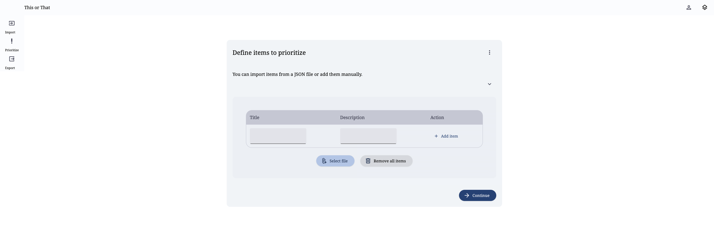
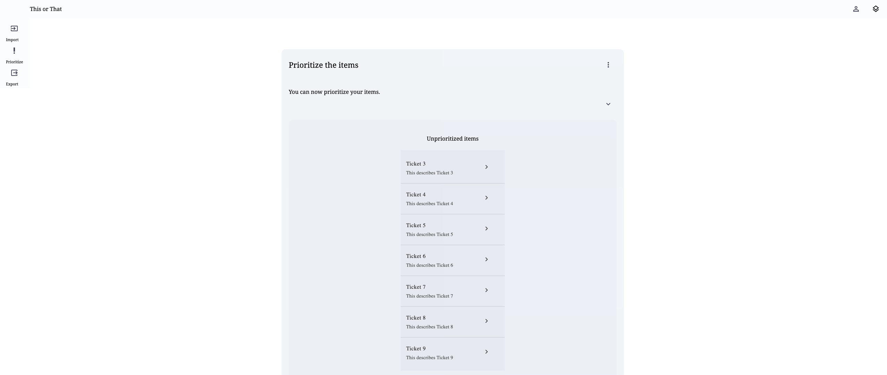

= This Or That

The goal of this application is to help you prioritize any list of unprioritized items by comparing them to each other.
This could be anything from a list of tasks to a list of movies you want to watch.

== How to run

Checkout `package.json` for the available commands.
For development use and go to http://localhost:3000/import

    npm run dev

== How to use

1. Add a list of items you want to prioritize. (Screen 1)
2. Compare two items at a time and choose which one is more important to you. (Screen 2, not the final design)
3. Repeat step 2 until you have compared all items.
4. View the results of your comparisons.

=== Screen 1

=== Screen 2

=== Open Tasks

. Figure out an optimal way to compare items (functionality only, no UI design yet)
.. Should probably make use of an optimal sorting algorithm which ideally allows to configure the number of items being compared at a time
.. The number of comparisons needed to get a prioritized list of all items should be minimized
. Design the UI for the prioritization screen
. Implement the UI for the prioritization  screen
. Design the UI for the export screen
. Implement the UI for the export screen
